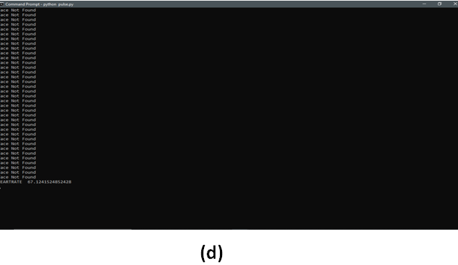

**Name:** _Monitoring Heart-Rate Using Web-Cam_

**Description:**
This project deals with real-time monitoring of a person’s heartbeat using web-cam. 
It replaces the traditional machines used for measuring the heart-rate which not only limits the mobility of patients 
but also causes local skin problems and may aid the spread of contagious infections between patients.

**Requirements:**
To run the above cod	e the requirements are:
Setup:
•	Python 3.7 
•	Laptop with a webcam 

**Modules:**
•	Opencv 
pip install opencv-python 
pip install opencv-contrib-python 
•	datetime 
pip install datetime 
•	Matplotlib 
Pip install matplotlib 
•	Pytimeparse 
Pip install pytimeparse 
•	Pylab 
Pip install pylab 
•	Skimage 
Pip install scikit-image 

**Run the project:**
1.	Open cmd with the folder containing the project 
2.	Python pulse.py 
3.	Person’s face should be tracked by the webcam 
The above commands will run the project. In order to smoothly execute the code a fluorescent light should be placed in front of the person’s face. 

**Input Sample:**

•	The webcam must track the person’s face perfectly using haarcascade frontal face detection.  
•	The green box is used to detect the person’s face. 
•	 The blue box is used to detect the forehead (adjust your position according to the blue box in such a manner that forehead lies within the box) 
•	Color variation will be seen in the blue box representing the change in pixel intensity with each cardiac cycle 
•	If there are no color variations, then external luminous provided by the fluorescent light isn’t sufficient 
•	The person need to wait until 90 frames to get the heartrate 

**Output Sample:**

**Figure (a):**
•	This graph represents the change in ppg (Photoplethysmography) signals with time. 
•	 There could be sudden increase or drop in the frequency due to external disturbance like light intensity. 
•	The graph also contains the person’s heart rate measured per minute. 

**Figure (b), (c):**
•	The figure b represents the variations of ppg signals in RGB channel 
•	The figure c represents the variations of ppg signals in LAB channel 
•	This figures are used to signify the variation of ppg signals in RGB and lab color space with motion artifacts of the person 

**Figure (d):**
•	This figure shows command prompt after closing all the graph windows. 
•	The cmd contains “Face not Found” for those frames whose face is not detected by haar-cascade algorithm. 
•	The frames in which the face is not detected are pruned 
•	The measured HeartRate is also displayed on the cmd . 

**References:**
[https://www.ncbi.nlm.nih.gov/pmc/articles/PMC5995145/](https://www.ncbi.nlm.nih.gov/pmc/articles/PMC5995145/)

[http://www.ep.liu.se/ecp/129/002/ecp16129002.pdf](http://www.ep.liu.se/ecp/129/002/ecp16129002.pdf)

***
##Contributor
[Swathi Guptha](https://github.com/Swathi-Guptha/Track-it)
